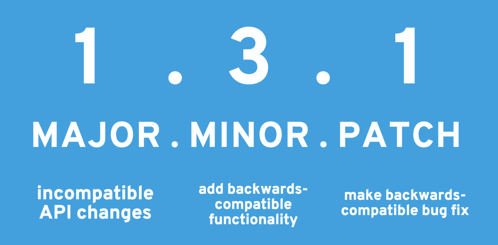

# [NPM](https://zamboney.github.io/meetup-npm)

form 0 to ninja!


## `npm init`
create the `package.json` file


```
// create package.json with prompt
npm init

// create package.json without prompt
npm init -f
```


## `npm install` 
installing a new dependency package that can be used in the package


```
// save the package in dependency
npm install --save <package>

// save the package in devDependency
npm install --save-dev <package>
```


## NPM run
npm as task runner


in the `package.json` There is a property called `scripts`. This property can be used as a task runner.


NPM run can read this scripts and also can detect it there a `pre` or `post` script


### extra:
[husky](https://www.npmjs.com/package/husky)


### .npmrc

`.npmrc` is a config file that can set the registry end point (and also other properties)
```
npm config list
```
in this demo we will use local `.npmrc` 
> the general `.npmrc` located in `~/.npmrc` on mac and `%userprofile%/.npmrc` in windows


## `npm publish`
publish the you package


NPM is a registry that can store packages for other developers use


1. `npm adduser` (done once in a machine).
    * register the user in the `.npmrc`
2. `npm publish`.
    * publish the package to the default repository


## `npm version`
*semver* version.


using `npm publish` can do only once per version (a.k.a. `package.json` version property).


to maintain changes NPM using Semantic Versioning (a.k.a *semver*).


### Semantic Versioning

> [leftpad](https://qz.com/646467/how-one-programmer-broke-the-internet-by-deleting-a-tiny-piece-of-code/)


|symbol|dependency|versions
|:-|:-|:-
|caret(^)|^1.2.3|1.\*.\*
|tilde(~)|~1.2.3|1.2.\*


```
npm version <major|minor|patch>;
npm version <major|minor|patch> -m "%s version update"
```


## npm scopes
group you code


scopes, in npm, is a way to district your code from other packages. this is can be use if your package use official NPM and your packages is in a local npm registry.


``` javascript
npm init --scope=username
npm config set scope username
```


## reuse of code

take you package to other  packages


once you publish (and handle the versioning) of your package you can now reuse that code.


## `npm link`
develop you packages form package


developing multi packages isn't an easy task. using `npm link` you can link your packages to where it use and develop the packages on the main packages.


``` javascript
npm link // in the source package
npm link <package-name> // in the root packages
npm ls --link // show the linked packages
```


## npm cli (extra)
convert your node package to cli


using the `package.json` bin property you can convert you `node index.js` in to a easy to cli


```
// put your package in the npm path
npm link 

// install the package globally
npm install -g <package-name>

// run you package cli command.
```


# TANK YOU!
